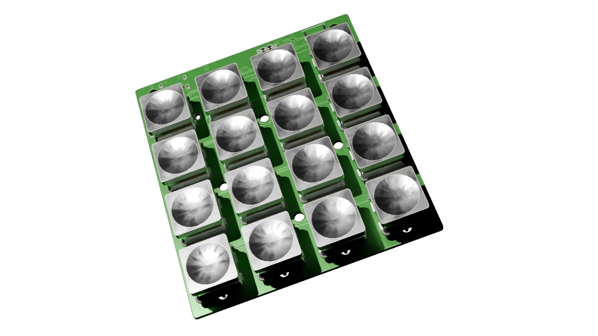
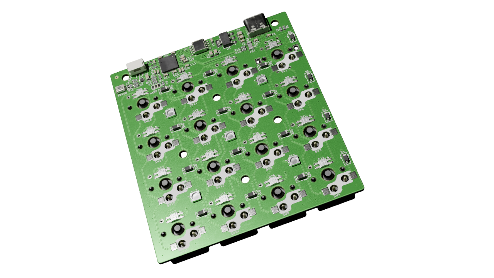
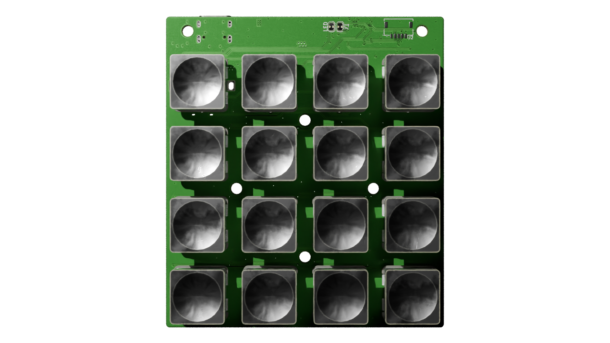
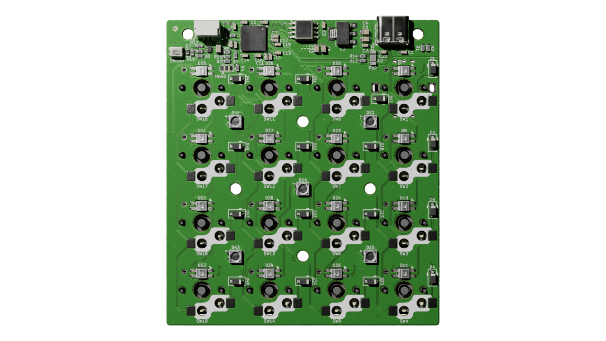
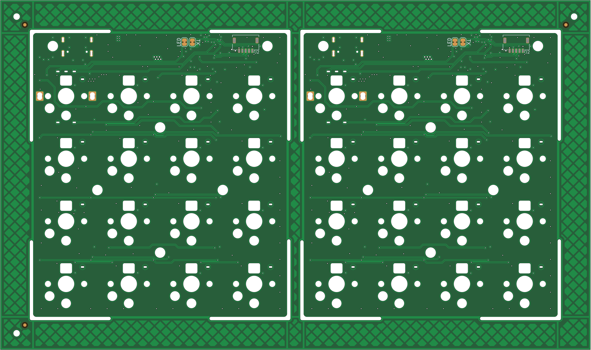

# Mad_RP2040

A small RP2040-based keypad PCB. Originally a minimal 2-key board to build confidence with the RP2040 ahead of a full-size keyboard, it has since grown into a 4x4 "anything" keypad with a rotary encoder and per-key RGB.

**Status:** Rev B (4x4) — fabricated November 2025; controller, USB and SK6812MINI-E chain verified, but a matrix wiring error past row 1 / col 1 needs cut-and-bodge to fix on existing units. The fix is not yet in `main`, so fabbing from `main` today reproduces the same bodge. Rev A (2-key) was fabricated and tested; archived under [`resources/rev_a/`](resources/rev_a/).

The encoder footprint is on the board but has not yet been populated/tested.



## Hardware

- **MCU:** Raspberry Pi RP2040 (QFN-56)
- **Flash:** W25Q128JV (16 MB QSPI)
- **Clock:** 12 MHz ECS-2520MV SMD oscillator
- **Power:** USB-C input, NCP1117-3.3 LDO, ECMF02-2 common-mode filter / ESD protection
- **Switches:** 16x Kailh Choc v2 hotswap (12 mm) in a 4x4 matrix with 1N4148W diodes
- **Encoder:** 1x EC12 rotary encoder with switch
- **Lighting:** Per-key SK6812MINI / SK6812MINI-E RGB LEDs
- **Split support:** TRS interlink (JST-SHL/GH connectors) plus a solder-jumper hand-detect selector
- **Programming:** ARM SWD via Tag-Connect TC2030-NL footprint

Datasheets for the major parts live in [`resources/datasheets/`](resources/datasheets/).

## Repository layout

```
Mad_RP2040.kicad_pro     # KiCad project
Mad_RP2040.kicad_sch     # Top-level schematic
Mad_RP2040.kicad_pcb     # Board layout
Mad_RP2040.kicad_dru     # Design rules
Controller_RP2040.kicad_sch
MCU_RP2040.kicad_sch
Switches.kicad_sch       # Hierarchical sheets
localLib.pretty/         # Project-local footprints
mad_lib/                 # Submodule with shared symbols/footprints
resources/               # Datasheets, enclosure STEP, fabrication outputs
build-panel.yaml         # KiBot panel config (1x2)
options.yaml             # KiBot global options
```

The repo uses a git submodule for `mad_lib`; clone with:

```sh
git clone --recurse-submodules https://github.com/Cimos/Mad_RP2040.git
```

## Build & CI

GitHub Actions in [`.github/workflows/`](.github/workflows/) drive the build via [Cimos/kibot-config](https://github.com/Cimos/kibot-config):

- `build-pcb-action.yaml` — fabrication outputs (gerbers, drills, BOM, position files)
- `build-images-action.yaml` — 2D top/bottom renders
- `build-cad-action.yaml` — STEP / 3D CAD export
- `build-panel-action.yaml` — KiKit panelization (2 cols x 1 row, see `build-panel.yaml`)
- `build-diff-action.yaml` — visual diff against the base branch
- `build-video-action.yaml` — turntable / fly-through video

Each workflow uploads its results as a GitHub Actions artifact on every push.

## Firmware

Keymap and configuration are kept in separate repos:

- [`Cimos/qmk_config`](https://github.com/Cimos/qmk_config) — [QMK](https://qmk.fm/) keymap
- [`Cimos/zmk-config`](https://github.com/Cimos/zmk-config) — [ZMK](https://zmk.dev/) keymap

## Enclosure

FreeCAD-exported cases live in [`resources/enclosures/`](resources/enclosures/):

- `MadRP2040 2-Key Case.step` — Rev A test board
- `MadRP2040 Anything Case.stl` — Rev B 4x4 anything keypad

Released board CAD (STEP) snapshots live under [`resources/rev_a/`](resources/rev_a/).

## Renders

Generated by the `build-images`, `build-cad` and `build-panel` workflows from the latest `main`.

| | |
|---|---|
|  |  |
|  |  |



## License

Released under the [MIT License](LICENSE). Copyright (c) 2023 Simon Maddison.
